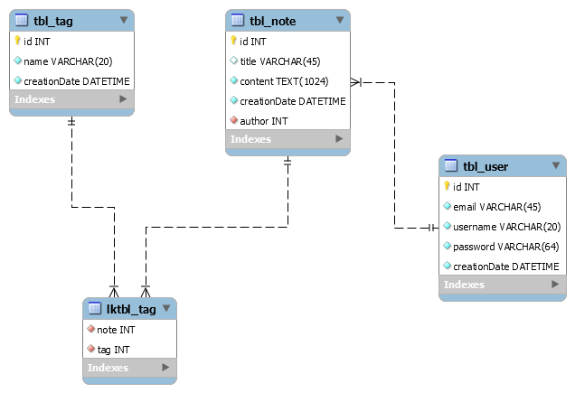

# toolset

> NOTE:  
>	this is still a work in progress (WIP)

**toolset** *Pronunciation /ˈto͞olset/ /ˈtulsɛt/*  
This Project is originates from the absence of quick and easy to use tools. For example, it is very hard to use tools on your phone without being distracted by other things.  

That is why we present to you the almighty **toolset**. With its easy to use design, and its clean code, you can do many great things such as

- take notes
- tag your notes
- log into your account
- register a new account

## Tools

Besides using some of the Go Standard Packages, we also use Tools such as

- [MySQL](https://www.mysql.com)
- [Mux](https://github.com/gorilla/mux)
- [go-mysql-driver](https://github.com/go-sql-driver/mysql)

## Go / Files / Database

### Schema

### Variables

All **variables** and **parameters** have to be `camelCase`. Parameters are preferred to be kept short, unless it is not possible.  
All **fields** in structs or elsewhere are Exported and should be `PascalCase`.  
In the Database all **column names** are written in `camelCase`.  

### Functions

All Functions should be either in `PascalCase` if exported, or in `camelCase` in case they are not to be exported.  
All Methods have pointer recivers (`func (x *MyType) MyFunc()`), as it is faster and the Fields of said Recivers can be changed.

### Packages

Each Package, that is related to a feature of the Project, should contain a handfull of files.  
Lets say, we have a package called `user`. This Package will be defined in a Subfolder also called `user`. In this Package we will have the main file called `user.go` where e.g. a struct is defined.  
In the same folder we will also add a file called `db.go` with all functions related to the database inside.  
Since we also use an API in this Project you will have to add yet another file called `handlers.go`, where all http related handling functions will be stored, wether handling rest-api requests or just plain `text/*`(or html) requests.

